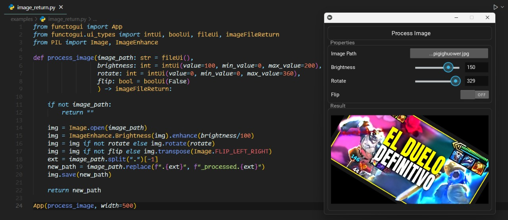

# FuncToGUI

</div>

</div>

**Easily turn your Python functions into GUI applications.**  
Perfect for internal tools, quick testing, or prototypes. FuncToGUI is cross-platform, updates in real-time, and requires no additional UI code. Implemented in fewer than 1000 lines of code!

FuncToGUI is built on top of [Kivy](https://kivy.org/) and [pyler](https://github.com/kivy/pyjnius) for file handling.

## Key Features
- **Function-to-GUI Transformation**: Turn your function parameters into a GUI interface with minimal setup.
- **No Complex Configuration**: Just define your function with the desired [`ui_types`](./functogui/ui_types) and let FuncToGUI generate the window.
- **Supports Various Parameter Types**:
  - `intUi` 
  - `boolUi`
  - `strUi`
  - `fileUi`
- **Supports Various Return Types**:
    - `boolReturn`
    - `intReturn`
    - `strReturn`
    - `imageFileReturn`
- **Easily Extensible**: You can create your own UI types if you need something more specific.

## Future Features
- **Support for more return and parameter types**
- **Support for more customization options**
- **Better control widgets**

##  Installation
```bash
git clone https://github.com/offerrall/FuncToGUI
cd FuncToGUI

pip install -e .
```
## Examples
- [Examples](./examples)

The examples folder contains all the examples you need to understand how to use FuncToGUI.