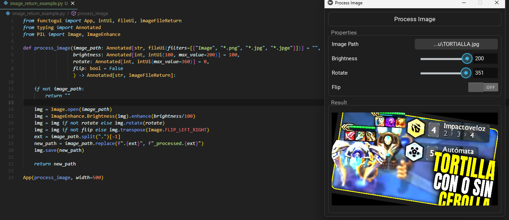

</div>

</div>

**Easily turn your Python functions into GUI applications.**  
Perfect for internal tools, quick testing, or prototypes. FuncToGUI is cross-platform, updates in real-time, and requires no additional UI code. Implemented in fewer than 1500 lines of code!

FuncToGUI is built on top of [Kivy](https://kivy.org/) and [pyler](https://github.com/kivy/plyer) for file handling.

## Quick Start
Normal function (no data limits):
```python
from functogui import App

def is_even(number: int = 4) -> bool:
    return number % 2 == 0

App(is_even)
```

Function with UI types (limits the input data):
```python
from functogui import App, intUi, intReturn
from typing import Annotated

def time_to_seconds(hours: Annotated[int, intUi(max_value=24)] = 1,
                    minutes: Annotated[int, intUi(max_value=59)] = 30
                    ) -> int:
    
    return (hours * 3600) + (minutes * 60)

App(time_to_seconds)
```

## Key Features
- **Function-to-GUI Transformation**: Turn your function parameters into a GUI interface with minimal setup.
- **No Complex Configuration**: Just define your function with the desired [`ui_types`](./functogui/ui_types.py) and let FuncToGUI generate the window.
- **Supports Various Parameter Types**:
  - `intUi` 
  - `boolUi`
  - `strUi`
  - `passwordUi`
  - `listUi`
  - `floatUi`
  - `fileUi`
  - `folderUi`
  - `colorUi`
- **Supports Various Return Types**:
    - `boolReturn`
    - `intReturn`
    - `strReturn`
    - `floatReturn`
    - `imageFileReturn`
- **Error Handling**: FuncToGUI treats the exceptions already for you.

##  Installation
```bash
git clone https://github.com/offerrall/FuncToGUI
cd FuncToGUI

pip install .
```

## How to Use
This library is designed to be as simple as possible. You only need look at the examples to understand how to use it.
- [Examples](./examples)