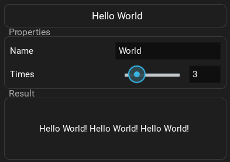

# FuncToGUI

From function to GUI:

<div style="display: flex; gap: 20px;">
<div>

```python
from functogui import App
from functogui.ui_types import strUi, intUi

def hello_world(name: str = strUi(value="World"),
                times: int = intUi(value=3, min_value=1, max_value=10),
                ) -> str:
    return f"Hello {name}! " * times

App(hello_world)
```
</div>

</div>

Your function becomes a GUI application - perfect for internal tools, quick testing, or prototypes. Cross-platform, real-time updates, no UI code needed. Written in less than 1000 lines.

