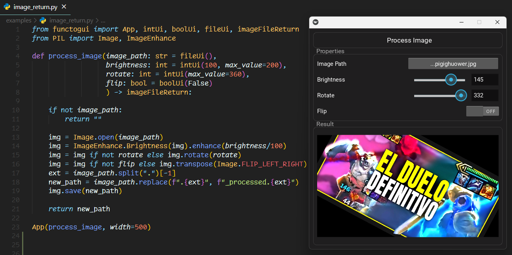

</div>

</div>

**Easily turn your Python functions into GUI applications.**  
Perfect for internal tools, quick testing, or prototypes. FuncToGUI is cross-platform, updates in real-time, and requires no additional UI code. Implemented in fewer than 1000 lines of code!

FuncToGUI is built on top of [Kivy](https://kivy.org/) and [pyler](https://github.com/kivy/plyer) for file handling.

## Quick Start
Normal function:
```python
from functogui import App

def is_even(number: int = 4) -> bool:
    return number % 2 == 0

App(is_even)
```

Function with UI types:
```python
from functogui import App, intUi, intReturn
from typing import Annotated

def time_to_seconds(hours: Annotated[int, intUi(max_value=24)] = 1,
                    minutes: Annotated[int, intUi(max_value=59)] = 30
                    ) -> int:
    
    return (hours * 3600) + (minutes * 60)

App(time_to_seconds)
```

## Key Features
- **Function-to-GUI Transformation**: Turn your function parameters into a GUI interface with minimal setup.
- **No Complex Configuration**: Just define your function with the desired [`ui_types`](./functogui/ui_types.py) and let FuncToGUI generate the window.
- **Supports Various Parameter Types**:
  - `intUi` 
  - `boolUi`
  - `strUi`
  - `fileUi`
- **Supports Various Return Types**:
    - `boolReturn`
    - `intReturn`
    - `strReturn`
    - `imageFileReturn`
- **Easily Extensible**: You can create your own UI types if you need something more specific.

##  Installation
```bash
git clone https://github.com/offerrall/FuncToGUI
cd FuncToGUI

pip install .
```

## How to Use
This library is designed to be as simple as possible. You only need look at the examples to understand how to use it.
- [Examples](./examples)


## Documentation

**`functogui.ui_types`**
- Define input types: `strUi`, `intUi`, `boolUi`, `fileUi`
- Define return types: `strReturn`, `intReturn`, `boolReturn`, `imageFileReturn`

**`functogui.inspect_function`**
- Extracts function signature and annotations
- Validates function parameters and return types

**`functogui.ui_widgets`**
- Custom Kivy widgets for each UI type
- Handle user input and validation
- Manage real-time callback updates

**`functogui.app_builder`**
- Creates dynamic GUI layout
- Manages window properties
- Handles function execution and result display

**`functogui.styles`**
- Contains all the styles for the GUI

## Roadmap 

### Core Features
- [ ] More parameter types (dateUi, colorUi, etc.)
- [ ] More return types (plotReturn, jsonReturn, etc.)
- [ ] Enhanced validation options
- [ ] Custom themes and styling through App class
- [ ] Improved error handling

### UI Improvements
- [ ] Better control widgets
- [ ] Responsive layouts
- [ ] Customizable themes

### Platform Support
- [ ] iOS compatibility testing
- [ ] Android compatibility testing
- [ ] Cross-platform improvements


## Discord
Join the [Discord](https://discord.gg/4yUxMCK3) server to discuss the project, ask questions, or suggest new features.